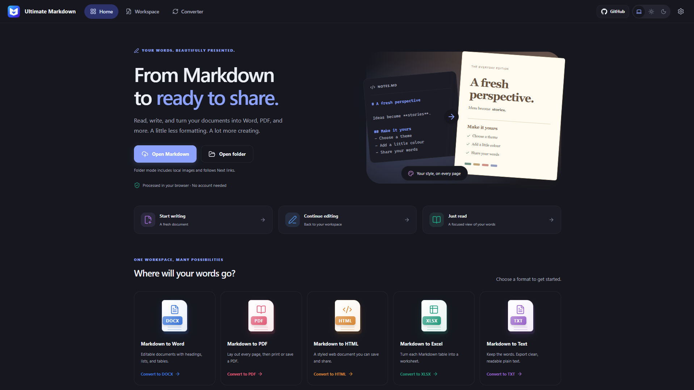
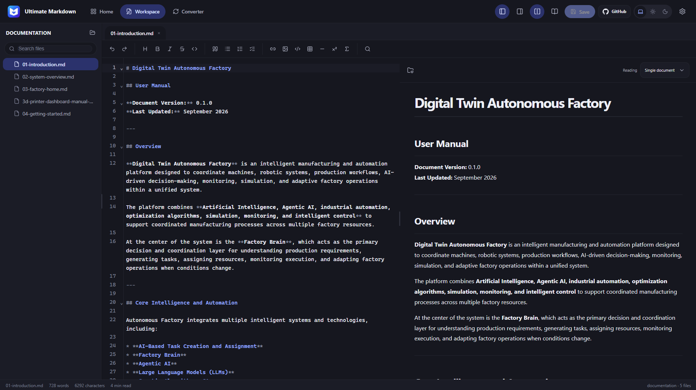
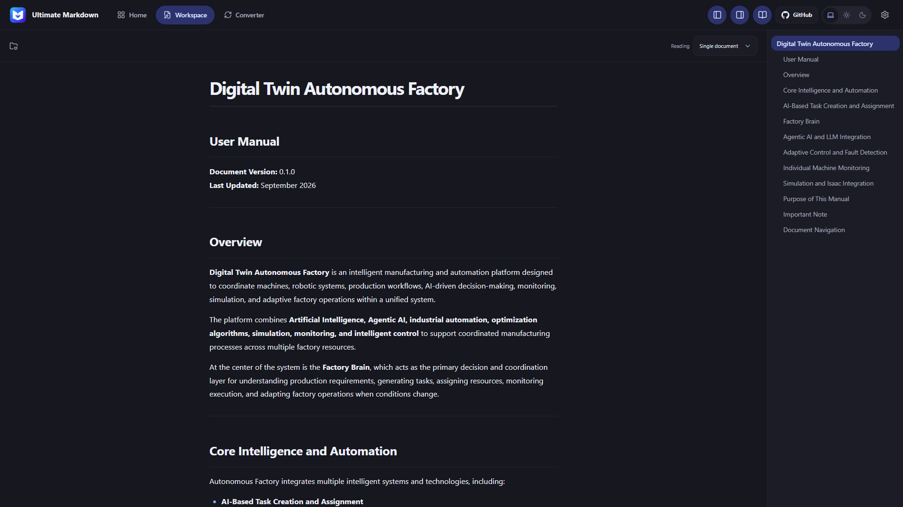
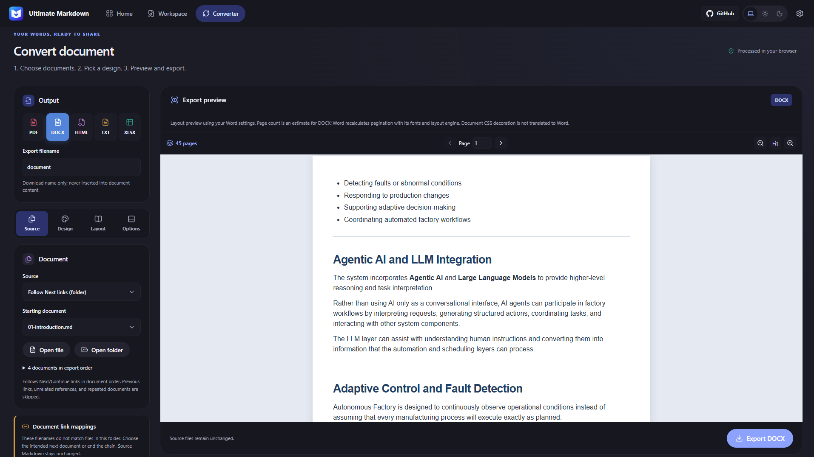

<div align="center">


# Ultimate Markdown

**Read. Write. Style. Export.**<br>
A Markdown workspace that turns your notes and linked manuals into documents ready to share.


[](LICENSE)

[][github-pages]
[][firebase-web]
[][firebase-app]
[][netlify]
[][cloudflare]

[🐛 Report an Issue](https://github.com/shiwamshoryasharma/Ultimate-Markdown/issues)

</div>

> [!NOTE]
> **Choose a hosting domain below to open the web app.** All five addresses are defined at the bottom of this README for easy editing.

| Hosting provider | Website |
| :--- | :--- |
| GitHub Pages | [shiwamshoryasharma.github.io/Ultimate-Markdown][github-pages] |
| Firebase Hosting · primary | [ultimate-markdown.web.app][firebase-web] |
| Firebase Hosting · alternative | [ultimate-markdown.firebaseapp.com][firebase-app] |
| Netlify | [ultimate-markdown.netlify.app][netlify] |
| Cloudflare Workers | [ultimate-markdown.shiwamshoryasharma.workers.dev][cloudflare] |



**Jump to:** [Features](#features) · [How to use](#how-to-use-the-web-app) · [Shortcuts](#keyboard-shortcuts) · [Local setup](#run-locally) · [Hosting](#build-and-host) · [License](#non-commercial-use)

## Features

| | What you can do |
| :--- | :--- |
| 📝 **Write and edit** | CodeMirror editor, formatting toolbar, document tabs, line numbers, undo/redo, and compact find/replace. |
| 👁️ **Read and preview** | Live Markdown rendering, headings and table of contents, tables, code highlighting, math, Mermaid, and sanitized HTML. |
| 📂 **Work with local files** | Open a single Markdown file, a folder, or drag and drop documents. Resolve local images with explicit file access. |
| 🔗 **Combine a manual** | Follow Next/Continue links within an opened folder, review the order, and choose replacements for missing links. |
| 🎨 **Design the output** | Six colour themes, five style presets, 20 font choices, page and text colours, and independent heading/body/code sizes. |
| 📐 **Control the page** | One, two, or three columns; margins; portrait/landscape; A4, A3, Letter, and Legal paper. |
| 📄 **Preview and export** | Paginated PDF preview, page count and zoom, plus DOCX, HTML, TXT, and XLSX export. |
| 🌗 **Make it comfortable** | Light/dark/system themes, responsive layouts, and focused reader mode. |

Documents are processed locally in your browser. There is no application backend, account requirement, or document-upload service. Remote images referenced by your Markdown may still be fetched from their original URLs.

## How to use the web app

### 1. Open or create a document

- Choose **Open Markdown** on Home for one file.
- Choose **Open folder** for a manual with related Markdown files and images.
- Choose **Start writing** for a new document, or edit the live example and select **Open in editor**.
- You can also drag and drop files or a folder onto the app.

Use the file explorer to switch documents. Opened documents appear as tabs. The Home example stays separate from your files until you explicitly open or export it.

### 2. Write, preview, and save

Edit in **Workspace** and see the rendered result beside your Markdown. Use the toolbar to insert headings, emphasis, lists, links, images, tables, code, and math. Switch to reader mode when you want to focus on the document, and use the table of contents to jump between headings.

Select **Save** or use the save shortcut. When the browser grants write access, saving updates the selected file; otherwise, the app downloads a copy. Save your edits before reloading or closing the tab: open document contents are not persisted across reloads.

<details>
<summary><strong>🖼️ See the editor and reader</strong></summary>

**Workspace — source and live preview**



**Reader — a focused document with a table of contents**



</details>

### 3. Connect local images

Opening a single Markdown file does not grant the browser access to neighbouring images. Use **Connect image folder** to select the folder containing the referenced paths, or **Locate image** to select an individual missing image. Your current text stays open.

For this layout, select the `manual` folder:

```text
manual/
├── introduction.md      # 
└── images/
    └── overview.png
```

Opening the entire folder also makes those relative image paths available. Attaching images to a single file does not automatically include other Markdown documents in its export.

### 4. Style and convert

Open **Converter**, choose **PDF**, **DOCX**, **HTML**, **TXT**, or **XLSX**, then work through the settings:

| Tab | Controls |
| :--- | :--- |
| **Source** | Starting document, current document, linked chain, selected documents, or entire folder workspace. |
| **Design** | Theme, style preset, font family, page/text/heading/link colours, H1–H6 sizes, body/code size, spacing, and table/code styles. |
| **Layout** | Paper size, orientation, margins, 1–3 columns, column gap, and a new page per source or continuous flow. |
| **Options** | Internal links, headers, footers, page-number fields, and safe document CSS where supported. |

Use **Parchment** for a light yellow page, or choose your own page colour. Preview the pages, check the total, and use the page selector or zoom controls before exporting. The export filename is only the download name; it is never inserted as a document heading.



| Output | What to expect |
| :--- | :--- |
| **PDF** | Select **Print / Save PDF**, then Save as PDF in the browser dialog. The app prints the paginated preview. |
| **DOCX** | Editable Word paragraphs, headings, lists, tables, supported images, links, columns, and page settings. |
| **HTML** | A standalone styled HTML document. |
| **TXT** | Readable plain text without document styling. |
| **XLSX** | One worksheet per table, with text-valued cells that preserve leading zeros and do not execute formulas. Requires at least one table. |

> [!TIP]
> For PDF, use **100% scale**, disable browser headers/footers, and enable background graphics to preserve page colours. Word recalculates DOCX pagination with its own fonts and layout engine, so the DOCX preview count is an **estimate**.

<details>
<summary><strong>🔤 Included font choices</strong></summary>

Aptos, Arial, Baskerville, Book Antiqua, Calibri, Cambria, Candara, Century Schoolbook, Constantia, Corbel, Courier New, Garamond, Georgia, Helvetica, Palatino Linotype, Segoe UI, Tahoma, Times New Roman, Trebuchet MS, and Verdana.

Fonts use those installed on your device. Unavailable families fall back locally; the app does not download these fonts. Custom document CSS decoration is not translated into Word styles.

</details>

### 5. Export linked Markdown as one manual

Open the **folder**, choose your starting document, and use **Follow Next links (folder)**. For example:

```markdown
**Previous:** [Introduction](./01-introduction.md) || **Next:** [HOME](./03-factory-home.md)
```

The app follows explicit Next/Continue links in order, skips repeated documents, and does not use Previous links to extend the chain. **New page for each document** is the default: a four-page document followed by a two-page document produces six pages with those settings.

Review the export order before downloading. If a target is missing, choose its replacement in **Document link mappings**, or end the chain. Repairs apply inside the app and do not rewrite the source Markdown. Single-file sources convert independently.

<details>
<summary><strong>Supplied test manual</strong></summary>

The external `documentation/` test folder is read-only and is not bundled with the app. Its owner-approved mapping follows:

```text
01-introduction.md → 02-system-overview.md → 03-factory-home.md → 04-getting-started.md
```

This mapping only activates when the complete four-file set is present and the original `03/04/05-factory-brain.md` targets are absent. It remains visible and editable in the converter.

</details>

## Keyboard shortcuts

Click inside the editor before using editing or search shortcuts. Save and New are handled on the Workspace page; browser or operating-system shortcuts can take precedence, especially New on some browsers. Use the visible buttons when a shortcut is intercepted.

| Action | Windows / Linux | macOS |
| :--- | :--- | :--- |
| Save | <kbd>Ctrl</kbd> + <kbd>S</kbd> | <kbd>⌘</kbd> + <kbd>S</kbd> |
| Save as | <kbd>Ctrl</kbd> + <kbd>Shift</kbd> + <kbd>S</kbd> | <kbd>⌘</kbd> + <kbd>Shift</kbd> + <kbd>S</kbd> |
| New document | <kbd>Ctrl</kbd> + <kbd>N</kbd> | <kbd>⌘</kbd> + <kbd>N</kbd> |
| Find | <kbd>Ctrl</kbd> + <kbd>F</kbd> | <kbd>⌘</kbd> + <kbd>F</kbd> |
| Find and replace | <kbd>Ctrl</kbd> + <kbd>H</kbd> | <kbd>⌘</kbd> + <kbd>H</kbd> |
| Next match, with Find focused | <kbd>Enter</kbd> | <kbd>Enter</kbd> |
| Previous match, with Find focused | <kbd>Shift</kbd> + <kbd>Enter</kbd> | <kbd>Shift</kbd> + <kbd>Enter</kbd> |
| Replace next, with Replace focused | <kbd>Enter</kbd> | <kbd>Enter</kbd> |
| Close Find/Replace | <kbd>Esc</kbd> | <kbd>Esc</kbd> |
| Undo | <kbd>Ctrl</kbd> + <kbd>Z</kbd> | <kbd>⌘</kbd> + <kbd>Z</kbd> |
| Redo | <kbd>Ctrl</kbd> + <kbd>Y</kbd> | <kbd>⌘</kbd> + <kbd>Shift</kbd> + <kbd>Z</kbd> |
| Select all | <kbd>Ctrl</kbd> + <kbd>A</kbd> | <kbd>⌘</kbd> + <kbd>A</kbd> |
| Indent / unindent | <kbd>Tab</kbd> / <kbd>Shift</kbd> + <kbd>Tab</kbd> | <kbd>Tab</kbd> / <kbd>Shift</kbd> + <kbd>Tab</kbd> |
| Move line up / down | <kbd>Alt</kbd> + <kbd>↑</kbd> / <kbd>↓</kbd> | <kbd>⌥</kbd> + <kbd>↑</kbd> / <kbd>↓</kbd> |

The Find panel also includes **match case**, **whole word**, **regular expression**, and **replace all** controls. Formatting actions are available through the editor toolbar.

## Run locally

Use **Node.js 22.12 or newer in the Node 22 line**, or a newer Node version supported by Vite 8, and npm.

```sh
git clone https://github.com/shiwamshoryasharma/Ultimate-Markdown.git
cd Ultimate-Markdown
npm ci
npm run dev
```

Open the local URL printed in the terminal. There are no API keys or backend services to configure. Chrome or Edge provides the native file/folder picker workflow; other supported browsers use fallback pickers where available.

## Build and host

```sh
npm run build
```

This creates `dist/`, then the automatic `postbuild` script copies its contents into **`web/`**, replacing the previous generated output and adding `.nojekyll` and the project `LICENSE`.

```text
web/
├── index.html
├── .nojekyll
├── LICENSE
├── assets/                        # Bundled JavaScript, styles, fonts and paginator
└── ultimate-markdown-logo.png
```

**`web/` is the ready-to-host folder committed in this repository.** Publish its contents as your host's document root. For services that build from source, use `npm ci && npm run build` and set the publish directory to `web`.

Production builds use relative asset paths and hash routes such as `/#/workspace`. The same folder can run at a domain root or under `/Ultimate-Markdown/` without server-side route rewrites. Serve it over HTTPS (or localhost for development), rather than double-clicking `index.html`.

### GitHub Pages: publish `web`

1. Open the repository's **Settings → Pages**.
2. Under **Build and deployment**, set **Source → GitHub Actions**.
3. Open **Actions → Publish web to GitHub Pages → Run workflow** and choose `main`.
4. Follow the deployment link shown by GitHub when the workflow completes.

The included [Pages workflow](.github/workflows/pages.yml) publishes the **committed `web` folder**. It runs manually, so pushing changes alone does not trigger deployment. Rebuild, commit, and push `web` before running it again.

> [!IMPORTANT]
> GitHub Pages' **Deploy from a branch** selector only supports the repository root or `/docs`; it cannot select `/web`. Use the included Actions workflow to publish `web`. See [GitHub's publishing-source documentation](https://docs.github.com/en/pages/getting-started-with-github-pages/configuring-a-publishing-source-for-your-github-pages-site).

The repository's Pages address is [shiwamshoryasharma.github.io/Ultimate-Markdown][github-pages]. Hosting links are maintained at the bottom of this README; changing a link does not configure hosting or DNS.

### Firebase Hosting

Live: [ultimate-markdown.web.app](https://ultimate-markdown.web.app/) · [ultimate-markdown.firebaseapp.com](https://ultimate-markdown.firebaseapp.com/)

The configuration publishes `web/` to Hosting site **`ultimate-markdown`**, inside Firebase project **`ultimate-markdown`** (display name **Ultimate-Markdown**). To deploy an update using the Firebase CLI:

```sh
firebase login
npm run build
firebase deploy --only hosting --project ultimate-markdown --config firebase.json
```

Keep the explicit project flag. This deploys Hosting only; it does not deploy databases, rules, or functions. No Firebase SDK initialization is required for this static app.

### Check the build

```sh
npm run preview       # Preview dist locally
npm run lint
npm test              # Browser regression suite
npm run test:web      # Test web at a root and repository subpath without SPA rewrites
```

Browser tests require installed Google Chrome. Two regression tests use the read-only sibling `documentation/` folder; set `UM_TEST_CORPUS` to another location if needed. Those two tests skip when the corpus is unavailable. Other checks cover find/replace, navigation, export XML, sanitization, and a six-page PDF with selectable text.

## Project structure

| Path | Purpose |
| :--- | :--- |
| `src/` | React UI, Zustand stores, Markdown rendering, file access, and conversion services. |
| `public/` | Static app assets. |
| `readme_assets/` | Screenshots used in this README. |
| `scripts/prepare-web.mjs` | Validated copy of each successful build into `web`. |
| `tests/` | Browser regression and static-host checks. |
| `web/` | Committed production files for hosting; regenerate instead of editing directly. |
| `.github/workflows/pages.yml` | Manual GitHub Pages deployment from `web`. |

Workspace-wide content search, document imports, an All Documents view, a command palette, and PWA support remain future work.

## Non-commercial use

> [!CAUTION]
> **You are not allowed to commercialise this project after cloning or forking it.** Do not sell it, offer a paid or monetised hosted version, or incorporate it into a commercial product or service without prior written permission from the owner. Modifying or rebranding the project does not remove this restriction.

Personal, educational, and other non-commercial use is permitted under the [Non-Commercial License](LICENSE). Keep the copyright, attribution, and license notice when sharing permitted copies or modifications. Third-party dependencies retain their own licenses. Independently authored documents opened or exported with the app are not relicensed by the project.

This is **source-available software with a non-commercial restriction**, not an unrestricted open-source license.

Created by [Shiwam Shorya Sharma](https://github.com/shiwamshoryasharma). For commercial permission, contact the repository owner.

---

<div align="center">

[GitHub Pages][github-pages] · [Firebase web.app][firebase-web] · [Firebase alternative][firebase-app] · [Netlify][netlify] · [Cloudflare Workers][cloudflare] · [Back to top](#ultimate-markdown)

</div>

<!-- HOSTING LINKS: update provider URLs here. -->
[github-pages]: https://shiwamshoryasharma.github.io/Ultimate-Markdown/
[firebase-web]: https://ultimate-markdown.web.app/
[firebase-app]: https://ultimate-markdown.firebaseapp.com/
[netlify]: https://ultimate-markdown.netlify.app/
[cloudflare]: https://ultimate-markdown.shiwamshoryasharma.workers.dev/
