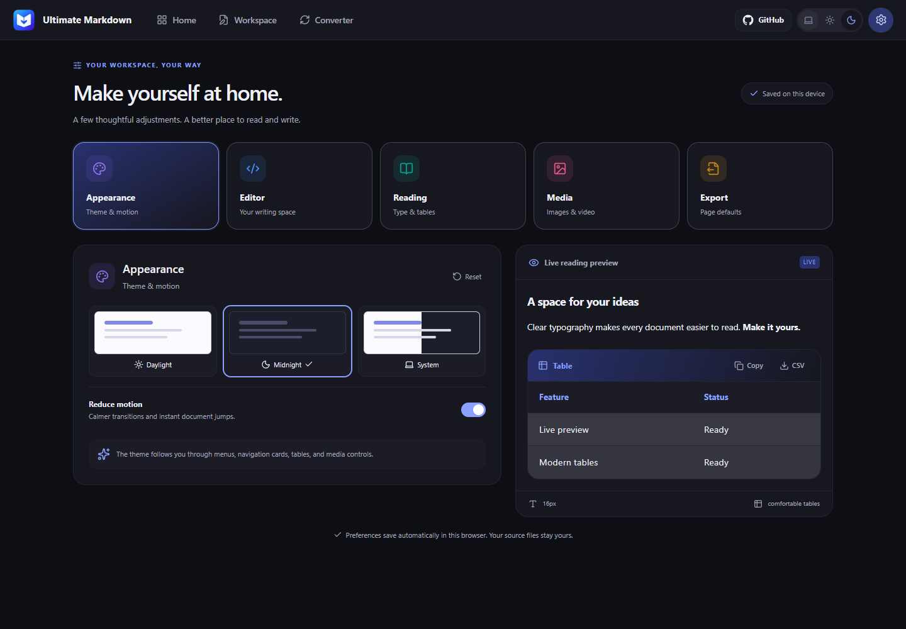

<div align="center">


# Ultimate Markdown

**Read. Write. Style. Export.**<br>
A Markdown workspace that turns your notes and linked manuals into documents ready to share.


[](LICENSE)

[][github-pages]
[][firebase-web]
[][firebase-app]
[][netlify]
[][cloudflare]

[🐛 Report an Issue](https://github.com/shiwamshoryasharma/Ultimate-Markdown/issues)

</div>

> [!NOTE]
> **Choose a hosting domain below to open the web app.** All five addresses are defined at the bottom of this README for easy editing.

| Hosting provider | Website |
| :--- | :--- |
| GitHub Pages | [shiwamshoryasharma.github.io/Ultimate-Markdown][github-pages] |
| Firebase Hosting · primary | [ultimate-markdown.web.app][firebase-web] |
| Firebase Hosting · alternative | [ultimate-markdown.firebaseapp.com][firebase-app] |
| Netlify | [ultimate-markdown.netlify.app][netlify] |
| Cloudflare Workers | [ultimate-markdown.shiwamshoryasharma.workers.dev][cloudflare] |


**Jump to:** [Features](#features) · [How to use](#how-to-use-the-web-app) · [Shortcuts](#keyboard-shortcuts) · [Local setup](#run-locally) · [Hosting](#build-and-host) · [License](#non-commercial-use)

## Features

| | What you can do |
| :--- | :--- |
| 📝 **Write and edit** | CodeMirror editor, formatting toolbar, document tabs, line numbers, undo/redo, and compact find/replace. |
| 👁️ **Read and preview** | Live Markdown rendering, headings and table of contents, tables, code highlighting, math, Mermaid, and sanitized HTML. |
| 📂 **Work with local files** | Open a single Markdown file, a folder, or drag and drop documents. Resolve local images with explicit file access. |
| 🔗 **Combine a manual** | Follow Next/Continue links within an opened folder, review the order, and choose replacements for missing links. |
| 🎨 **Design the output** | Six colour themes, five style presets, 20 font choices, page and text colours, and independent heading/body/code sizes. |
| 📐 **Control the page** | One, two, or three columns; margins; portrait/landscape; A4, A3, Letter, and Legal paper. |
| 📄 **Preview and export** | Paginated PDF preview, page count and zoom, plus DOCX, HTML, TXT, and XLSX export. |
| 🌗 **Make it comfortable** | Coloured Settings cards, light/dark/system themes, reading presets, compact tables, reduced motion, and a live reading preview. |
| 🖼️ **Explore rich content** | Image zoom and downloads; themed video/audio playback, seeking, volume and speed; video fullscreen. |
| 🧾 **Work with tables** | Modern responsive tables with row highlights, copy-to-clipboard, and CSV downloads. |

Editing, parsing, review and conversion run locally in your browser. Webpage import uses the optional Chrome/Edge companion extension to download public HTML and image copies directly on your device after permission for the current visit. It needs no backend, account or API key. Local HTML and DOCX files are never uploaded. Referenced remote images may also load from their original URLs.

## How to use the web app

### 1. Open or create a document

- Choose **Open Markdown** on Home for one file.
- Choose **Open folder** for a manual with related Markdown files and images.
- Choose **Start writing** for a new document, or edit the live example and select **Open in editor**.
- You can also drag and drop files or a folder onto the app.

Use the file explorer to switch documents. Opened documents appear as tabs with file icons. Use **+** to create another Markdown file. Double-click a tab, press **F2**, or use its pencil icon to rename it; **Enter** confirms and **Escape** cancels. The Home example stays separate from your files until you explicitly open or export it.

### 2. Write, preview, and save

Edit in **Workspace** and see the rendered result beside your Markdown. Use the toolbar to insert headings, emphasis, lists, links, images, tables, code, and math. Switch to reader mode when you want to focus on the document, and use the table of contents to jump between headings.

Recognized **Previous / Next** links become themed navigation cards, with **Top**, **Bottom**, and a **Jump to document** menu when a folder is open. Common variations work: bold labels, arrows, reversed order, separate paragraphs, lists, reference links, and two-column navigation tables. Ordinary prose and code examples stay intact. File names can be anything; explicit links determine the order.

Tables have responsive scrolling, clearer headers, **Copy**, and **CSV** actions. Click an unlinked image to expand it, zoom from 100–300%, or download it; **Escape** closes the viewer. Linked images retain their original link. Videos and audio use themed controls for playback, seeking, volume, and speed; videos also support fullscreen. Remote downloads depend on the source server and browser. Local media needs access to its source folder.

Open **Settings** using the gear icon. Choose a coloured **Appearance**, **Editor**, **Reading**, **Media**, or **Export** card to reveal that section. Try **Comfort reading** or **Dense documents**, choose table density, toggle image captions, or reduce motion. Preferences save automatically on this device. Export defaults update the converter directly; each card has its own Reset action.



One shared file tab bar controls both the editor and preview. Selecting a document updates both panes together. The same tabs remain available in reader mode and mobile preview; **+ New Markdown** creates a document for both.

Select **Save** or use the save shortcut. When the browser grants write access, saving updates the selected file; otherwise, the app downloads a copy. After renaming an opened document, **Save / Ctrl+S downloads the new filename**; it does not overwrite the original file under its old name. **Save As** chooses a new disk location where supported. Save your edits before reloading or closing the tab: open document contents are not persisted across reloads.

<details>
<summary><strong>🖼️ See the editor and reader</strong></summary>

**Workspace — source and live preview**


**Reader — a focused document with a table of contents**


</details>

### 3. Connect local images

Opening a single Markdown file does not grant the browser access to neighbouring images. Use **Connect image folder** to select the folder containing the referenced paths, or **Locate image** to select an individual missing image. Your current text stays open.

For this layout, select the `manual` folder:

```text
manual/
├── introduction.md      # 
└── images/
    └── overview.png
```

Opening the entire folder also makes those relative image paths available. Attaching images to a single file does not automatically include other Markdown documents in its export.

### 4. Style and convert

Open **Converter**, choose **PDF**, **DOCX**, **HTML**, **TXT**, or **XLSX**, then work through the settings:

| Tab | Controls |
| :--- | :--- |
| **Source** | Starting document, current document, linked chain, selected documents, or entire folder workspace. |
| **Design** | Theme, style preset, font family, page/text/heading/link colours, H1–H6 sizes, body/code size, spacing, and table/code styles. |
| **Layout** | Paper size, orientation, margins, 1–3 columns, column gap, and a new page per source or continuous flow. |
| **Options** | Internal links, headers, footers, page-number fields, and safe document CSS where supported. |

Use **Parchment** for a light yellow page, or choose your own page colour. Preview the pages, check the total, and use the page selector or zoom controls before exporting. The export filename is only the download name; it is never inserted as a document heading.


| Output | What to expect |
| :--- | :--- |
| **PDF** | Select **Print / Save PDF**, then Save as PDF in the browser dialog. The app prints the paginated preview. |
| **DOCX** | Editable Word paragraphs, headings, lists, tables, supported images, links, columns, and page settings. |
| **HTML** | A standalone styled HTML document. |
| **TXT** | Readable plain text without document styling. |
| **XLSX** | One worksheet per table, with text-valued cells that preserve leading zeros and do not execute formulas. Requires at least one table. |

> [!TIP]
> For PDF, use **100% scale**, disable browser headers/footers, and enable background graphics to preserve page colours. Word recalculates DOCX pagination with its own fonts and layout engine, so the DOCX preview count is an **estimate**.

<details>
<summary><strong>🔤 Included font choices</strong></summary>

Aptos, Arial, Baskerville, Book Antiqua, Calibri, Cambria, Candara, Century Schoolbook, Constantia, Corbel, Courier New, Garamond, Georgia, Helvetica, Palatino Linotype, Segoe UI, Tahoma, Times New Roman, Trebuchet MS, and Verdana.

Fonts use those installed on your device. Unavailable families fall back locally; the app does not download these fonts. Custom document CSS decoration is not translated into Word styles.

</details>

### 5. Export linked Markdown as one manual

Open the **folder**, choose your starting document, and use **Follow Next links (folder)**. For example:

```markdown
**Previous:** [Introduction](./01-introduction.md) || **Next:** [HOME](./03-factory-home.md)
```

The app follows explicit Next/Continue links in order, skips repeated documents, and does not use Previous links to extend the chain. **New page for each document** is the default: a four-page document followed by a two-page document produces six pages with those settings.

Review the export order before downloading. If a target is missing, choose its replacement in **Document link mappings**, or end the chain. Repairs apply inside the app and do not rewrite the source Markdown. Single-file sources convert independently.

<details>
<summary><strong>Supplied test manual</strong></summary>

The external `documentation/` test folder is read-only and is not bundled with the app. Its owner-approved mapping follows:

```text
01-introduction.md → 02-system-overview.md → 03-factory-home.md → 04-getting-started.md
```

This mapping only activates when the complete four-file set is present and the original `03/04/05-factory-brain.md` targets are absent. It remains visible and editable in the converter.

</details>

## Import webpages, HTML and Word

Choose **Import** in the navigation. **Web Page** uses the **Ultimate Markdown URL Import companion extension** in Chrome or Edge. Install it once using **Download extension** and the instructions on the Import screen. Paste a URL, approve **Allow for this visit** in the extension window, then select **Convert to Markdown**. The extension downloads the HTML directly on your device, and the existing browser pipeline prepares the preview and Markdown. There is no download backend, account, API key or provider configuration. If a website refuses access, requires login or provides no readable HTML, use **Import saved or pasted HTML**; its source URL is retained for relative links and images.

**HTML** accepts pasted markup or an uploaded `.html`/`.htm` file, an optional source URL, and matching local image attachments. **Word Document** parses DOCX locally, including embedded raster images and Word styles. Neither requires the extension or URL permission. Change style mappings and explicitly reparse when needed. **Documentation Site** discovers a bounded set of same-domain pages through the approved extension session, lets you select them, and retains their chosen order.

Every source opens a continuous document **Preview**, with **Copy Markdown** and **Download .md** visible above it. Markdown download uses the reviewed content directly; it does not require a PDF preview or a second confirmation. **Markdown** shows the generated source, **Edit blocks** exposes cleanup tools, and **Open in editor** continues in the existing workspace. Extraction notes stay collapsed. **More formats** opens the existing PDF/DOCX/HTML preview, design controls and Converter handoff. Multiple imported pages download as a Markdown ZIP.

Main content extraction retains headings, nested lists and tasks, inline/fenced code, tables (complex cells stay HTML), links, callouts, captions and article images. Relative image paths, lazy-load attributes, `srcset` and `picture` sources resolve against the source URL. Remote image URLs stay in Markdown even if their bytes cannot be read. Temporary image copies feed the existing export model; when direct image fetching fails, the app tries the approved extension session. If the source still refuses the image, a warning explains that it remains linked. HTML/PDF can display linked images when the source permits it; DOCX preserves a source link if it cannot embed the image.

Import content and its original HTML stay in memory. Moving between application pages retains the review. **Close import session**, replacement or browser reload discards the temporary source; downloaded files and Markdown already opened in the editor are independent. Save before closing the browser. HTML/webpage content and DOCX files support up to **200 MiB** each. Word archives have a separate 512 MiB expanded-content bound. A cancellable browser worker prepares HTML and converts DOCX; local files are never uploaded. Long reviews show 100 sections at a time, with a 200,000-character display cap per section batch; Markdown downloads retain the complete content. Documentation discovery allows 30 pages / depth 3 within a 200 MiB session budget. Optional remote image copies remain limited to 60 images / 8 MiB per session.

### Extension setup and visit permissions

Imported inline text, links, emphasis and line breaks stay together. Safe HTML without a faithful Markdown equivalent is preserved: disclosures (`details`/`summary`), definition lists, merged tables, superscript/subscript, keyboard keys, highlights, underline and other semantic text. Scripts, event handlers, embedded frames and source styles remain removed; import preserves document content, not an interactive website or its exact CSS layout. A **Back to top** button appears after scrolling in import Preview/Markdown and the workspace reader, including mobile layouts.

The companion is currently an **unpacked extension**, not a Chrome Web Store listing. Download its ZIP, extract it into a permanent folder, open `chrome://extensions` or `edge://extensions`, enable Developer mode and select **Load unpacked**. Choose the extracted folder containing `manifest.json`. Save any unsaved documents before reloading the app to connect it. The website cannot silently install the extension or approve Chrome's permission prompt.

On first use, Chrome requests optional HTTP/HTTPS website access. The extension separately asks for approval on **every app visit**. That visit allows multiple public URLs, resets on refresh/navigation away/tab close, and can be ended with **End URL session**. Internal app navigation keeps the same visit; another tab needs its own approval. Chrome's underlying host permission remains until revoked in extension settings, but cannot substitute for the extension's per-visit approval.

Only `ultimate-markdown.web.app`, `ultimate-markdown.firebaseapp.com`, and localhost/127.0.0.1 development ports 5173, 4173, 5174 and 4174 can connect. Other deployment domains require an explicit extension allowlist update. See [extension/README.md](extension/README.md) for access boundaries and update instructions.

`npm run build` packages the extension and copies it to the static output along with the app. Both Firebase Hosting and `npm start` serve static files; neither runs a URL download API:

```sh
npm run build
npm start
```

The local static server defaults to `http://localhost:4173`. Vite development uses `http://localhost:5173`. Both use the same extension path as production. `VITE_IMPORT_ENDPOINT` and `IMPORT_ALLOWED_ORIGINS` are no longer used by the app.

URL downloads now work through the installed companion on the static Firebase site; Firebase billing and Cloud Run are not required. Local HTML/DOCX imports, the editor, and exports continue to work without the companion. Mobile browsers without Chrome-compatible extension support can use local HTML/DOCX import.

The extension omits credentials and streams bounded chunks, retains the 200 MiB HTML limit and cancellation, and never executes imported website scripts. The existing parser still sanitizes all content. Historical Node download-service modules and their tests remain in the repository but are disconnected from the default Vite/static app. Run `node --test tests/extension-core.test.mjs tests/extension-session.test.mjs` and `npx playwright test tests/extension-import.spec.ts` for companion regression coverage.

## Keyboard shortcuts

Click inside the editor before using editing or search shortcuts. Save and New are handled on the Workspace page. Chrome reserves Ctrl+N for a new browser window. Use **Ctrl+Alt+N** or the always-visible **+ New Markdown** button to create a document.

| Action | Windows / Linux | macOS |
| :--- | :--- | :--- |
| Save | <kbd>Ctrl</kbd> + <kbd>S</kbd> | <kbd>⌘</kbd> + <kbd>S</kbd> |
| Save as | <kbd>Ctrl</kbd> + <kbd>Shift</kbd> + <kbd>S</kbd> | <kbd>⌘</kbd> + <kbd>Shift</kbd> + <kbd>S</kbd> |
| New document | <kbd>Ctrl</kbd> + <kbd>Alt</kbd> + <kbd>N</kbd> | <kbd>Control</kbd> + <kbd>⌥</kbd> + <kbd>N</kbd> |
| Rename focused document tab | <kbd>F2</kbd> | <kbd>F2</kbd> |
| Find | <kbd>Ctrl</kbd> + <kbd>F</kbd> | <kbd>⌘</kbd> + <kbd>F</kbd> |
| Find and replace | <kbd>Ctrl</kbd> + <kbd>H</kbd> | <kbd>⌘</kbd> + <kbd>H</kbd> |
| Next match, with Find focused | <kbd>Enter</kbd> | <kbd>Enter</kbd> |
| Previous match, with Find focused | <kbd>Shift</kbd> + <kbd>Enter</kbd> | <kbd>Shift</kbd> + <kbd>Enter</kbd> |
| Replace next, with Replace focused | <kbd>Enter</kbd> | <kbd>Enter</kbd> |
| Close Find/Replace | <kbd>Esc</kbd> | <kbd>Esc</kbd> |
| Undo | <kbd>Ctrl</kbd> + <kbd>Z</kbd> | <kbd>⌘</kbd> + <kbd>Z</kbd> |
| Redo | <kbd>Ctrl</kbd> + <kbd>Y</kbd> | <kbd>⌘</kbd> + <kbd>Shift</kbd> + <kbd>Z</kbd> |
| Select all | <kbd>Ctrl</kbd> + <kbd>A</kbd> | <kbd>⌘</kbd> + <kbd>A</kbd> |
| Indent / unindent | <kbd>Tab</kbd> / <kbd>Shift</kbd> + <kbd>Tab</kbd> | <kbd>Tab</kbd> / <kbd>Shift</kbd> + <kbd>Tab</kbd> |
| Move line up / down | <kbd>Alt</kbd> + <kbd>↑</kbd> / <kbd>↓</kbd> | <kbd>⌥</kbd> + <kbd>↑</kbd> / <kbd>↓</kbd> |

The Find panel also includes **match case**, **whole word**, **regular expression**, and **replace all** controls. Formatting actions are available through the editor toolbar.

## Run locally

Use **Node.js 22.12 or newer in the Node 22 line**, or a newer Node version supported by Vite 8, and npm.

```sh
git clone https://github.com/shiwamshoryasharma/Ultimate-Markdown.git
cd Ultimate-Markdown
npm ci
npm run dev
```

Open the local URL printed in the terminal. There are no API keys or backend services to configure. Chrome or Edge provides the native file/folder picker workflow; other supported browsers use fallback pickers where available.

## Build and host

```sh
npm run build
```

This creates `dist/`, then the automatic `postbuild` script copies its contents into **`web/`**, replacing the previous generated output and adding `.nojekyll` and the project `LICENSE`.

```text
web/
├── index.html
├── .nojekyll
├── LICENSE
├── assets/                        # Bundled JavaScript, styles, fonts and paginator
└── ultimate-markdown-logo.png
```

**`web/` is the ready-to-host folder committed in this repository.** Publish its contents as your host's document root. For services that build from source, use `npm ci && npm run build` and set the publish directory to `web`.

Production builds use relative asset paths and hash routes such as `/#/workspace`. The same folder can run at a domain root or under `/Ultimate-Markdown/` without server-side route rewrites. Serve it over HTTPS (or localhost for development), rather than double-clicking `index.html`.

### GitHub Pages: publish `web`

1. Open the repository's **Settings → Pages**.
2. Under **Build and deployment**, set **Source → GitHub Actions**.
3. Open **Actions → Publish web to GitHub Pages → Run workflow** and choose `main`.
4. Follow the deployment link shown by GitHub when the workflow completes.

The included [Pages workflow](.github/workflows/pages.yml) publishes the **committed `web` folder**. It runs manually, so pushing changes alone does not trigger deployment. Rebuild, commit, and push `web` before running it again.

> [!IMPORTANT]
> GitHub Pages' **Deploy from a branch** selector only supports the repository root or `/docs`; it cannot select `/web`. Use the included Actions workflow to publish `web`. See [GitHub's publishing-source documentation](https://docs.github.com/en/pages/getting-started-with-github-pages/configuring-a-publishing-source-for-your-github-pages-site).

The repository's Pages address is [shiwamshoryasharma.github.io/Ultimate-Markdown][github-pages]. Hosting links are maintained at the bottom of this README; changing a link does not configure hosting or DNS.

### Firebase Hosting

Live: [ultimate-markdown.web.app](https://ultimate-markdown.web.app/) · [ultimate-markdown.firebaseapp.com](https://ultimate-markdown.firebaseapp.com/)

The configuration publishes `web/` to Hosting site **`ultimate-markdown`**, inside Firebase project **`ultimate-markdown`** (display name **Ultimate-Markdown**). To deploy an update using the Firebase CLI:

```sh
firebase login
npm run build
firebase deploy --only hosting --project ultimate-markdown --config firebase.json
```

Keep the explicit project flag. This deploys Hosting only; it does not deploy databases, rules, or functions. No Firebase SDK initialization is required for this static app.

### Netlify ZIP deployment

Extract **Ultimate-Markdown.zip** and drop the folder containing `index.html` into Netlify's manual deploy area. The ZIP contains the built `web/` files at its root; no build command is needed. Hash routes support Workspace, Import and Converter without rewrite rules.

A manual static deployment includes the editor, local DOCX/HTML imports and exports. URL import uses the installed companion extension. The shipped companion accepts only the Firebase domains and development origins listed above. To support a Netlify site, explicitly add its exact origin to the extension's manifest and app-origin allowlist, then distribute that updated extension.

### Google Search Console verification

The owner's verification file is kept in `public/google12dac00c9b91bd8b.html`. Each build copies it into `dist` and `web`, so it remains available after redeployment at [the verification URL](https://ultimate-markdown.web.app/google12dac00c9b91bd8b.html).

For the `https://ultimate-markdown.web.app/` URL-prefix property, choose **HTML file** verification and click **Verify** after deployment. Keep the file's name and content unchanged. Google checks this file at the website root, independently of the app's interface.

### Sitemap

[sitemap.xml](https://ultimate-markdown.web.app/sitemap.xml) lists the public Firebase homepage. [robots.txt](https://ultimate-markdown.web.app/robots.txt) allows crawling and points to the sitemap. Both files live in `public/` and are included in every build.

In Google Search Console, open the `https://ultimate-markdown.web.app/` property, select **Sitemaps**, enter `sitemap.xml`, and submit. The app's `#/workspace`, `#/converter`, and `#/settings` views are hash routes within the same page, so they are not listed as separate sitemap URLs. Local Markdown documents are never published or included in the sitemap.

### Check the build

```sh
npm run preview       # Preview dist locally
npm run lint
npm test              # Browser regression suite
npm run test:web      # Test web at a root and repository subpath without SPA rewrites
```

Browser tests require installed Google Chrome. Two regression tests use the read-only sibling `documentation/` folder; set `UM_TEST_CORPUS` to another location if needed. Those two tests skip when the corpus is unavailable. Other checks cover find/replace, navigation, export XML, sanitization, and a six-page PDF with selectable text.

## Project structure

| Path | Purpose |
| :--- | :--- |
| `src/` | React UI, Zustand stores, Markdown rendering, file access, and conversion services. |
| `public/` | Static app assets. |
| `readme_assets/` | Screenshots used in this README. |
| `scripts/prepare-web.mjs` | Validated copy of each successful build into `web`. |
| `tests/` | Browser regression and static-host checks. |
| `web/` | Committed production files for hosting; regenerate instead of editing directly. |
| `.github/workflows/pages.yml` | Manual GitHub Pages deployment from `web`. |

Workspace-wide content search, document imports, an All Documents view, a command palette, and PWA support remain future work.

## Non-commercial use

> [!CAUTION]
> **You are not allowed to commercialise this project after cloning or forking it.** Do not sell it, offer a paid or monetised hosted version, or incorporate it into a commercial product or service without prior written permission from the owner. Modifying or rebranding the project does not remove this restriction.

Personal, educational, and other non-commercial use is permitted under the [Non-Commercial License](LICENSE). Keep the copyright, attribution, and license notice when sharing permitted copies or modifications. Third-party dependencies retain their own licenses. Independently authored documents opened or exported with the app are not relicensed by the project.

This is **source-available software with a non-commercial restriction**, not an unrestricted open-source license.

Created by [Shiwam Shorya Sharma](https://github.com/shiwamshoryasharma). For commercial permission, contact the repository owner.

---

<div align="center">

[GitHub Pages][github-pages] · [Firebase web.app][firebase-web] · [Firebase alternative][firebase-app] · [Netlify][netlify] · [Cloudflare Workers][cloudflare] · [Back to top](#ultimate-markdown)

</div>

<!-- HOSTING LINKS: update provider URLs here. -->
[github-pages]: https://shiwamshoryasharma.github.io/Ultimate-Markdown/
[firebase-web]: https://ultimate-markdown.web.app/
[firebase-app]: https://ultimate-markdown.firebaseapp.com/
[netlify]: https://ultimate-markdown.netlify.app/
[cloudflare]: https://ultimate-markdown.shiwamshoryasharma.workers.dev/

Destructive document and import actions use a themed confirmation dialog with keyboard navigation, Escape to cancel, and explicit discard actions. The dialog follows the light, dark or system theme.
